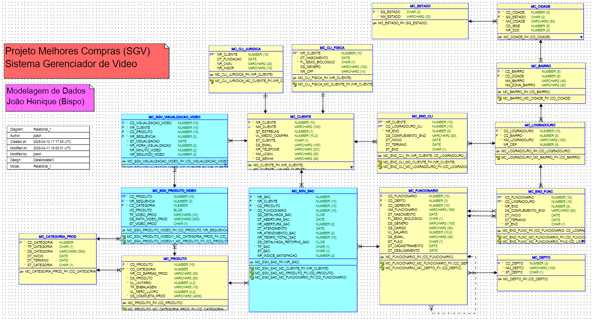
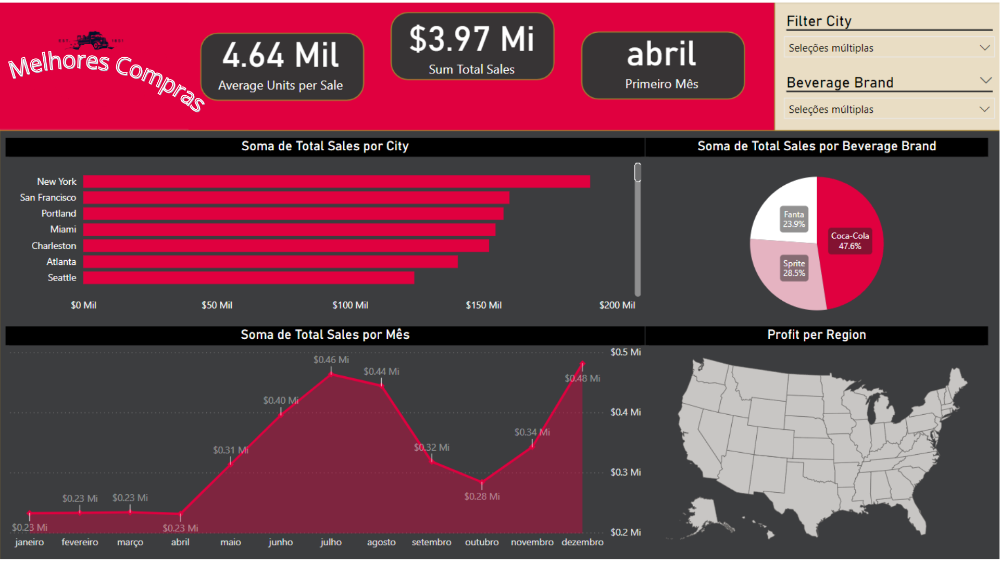

# 📽️ SGV - Sistema Gerenciador de Vídeo  
Projeto acadêmico com foco em modelagem de dados, SQL e visualização de dados.

## 🎯 Objetivo  
Desenvolver um sistema de banco de dados relacional para gerenciar vídeos e otimizar decisões comerciais com base em dados reais de consumo, utilizando ferramentas de BI para análise de performance e insights estratégicos.

## 🛠️ Tecnologias Utilizadas  
- SQL (DDL/DML/DQL)  
- Oracle Database  
- Power BI  
- Python (para tratamento de dados)  
- Ferramentas de modelagem (Lucidchart / Draw.io)

## 🧩 Modelagem de Dados  

### MER Físico  

## 📊 Dashboard "Melhores Compras"  

Dashboard interativo para análise de vendas, comportamento do consumidor e desempenho por região/marca.

## 🚀 Como Executar  
1. Execute o script SQL `Script_DDL_Melhores_Compras.sql` para criar o banco.  
2. Utilize os dados fornecidos (ou simulados) para alimentar o sistema.  
3. Acesse o dashboard para visualizar os insights em tempo real.

## 👤 Autor  
João Henrique (Bispo) Arantes  
[LinkedIn](https://www.linkedin.com/in/joaoharv/)  
